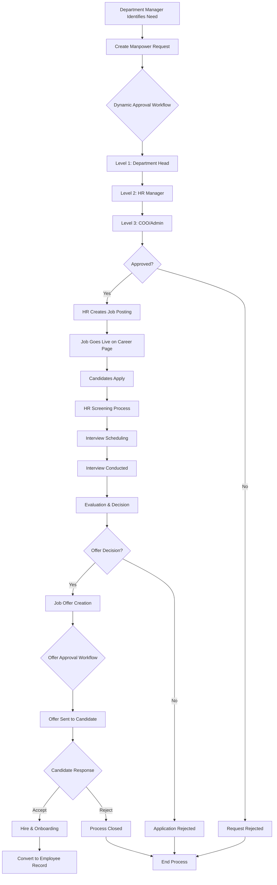
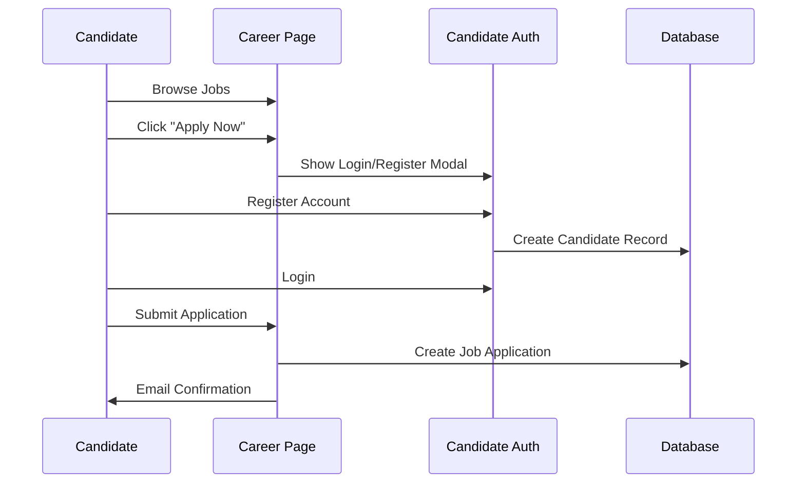
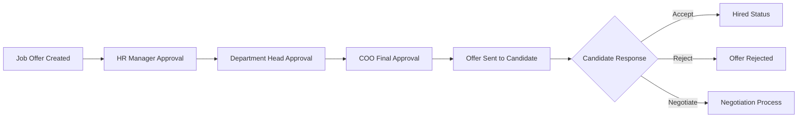

# 🎯 Recruitment Module Process Flow

## 📋 Complete End-to-End Process



## 🏢 Phase 1: Manpower Planning & Approval

### Step 1: Manpower Request Creation
```php
// Department Manager creates request
ManpowerRequest::create([
    'branch_id' => Auth::user()->branch_id,
    'department_id' => $departmentId,
    'position' => 'Software Developer',
    'vacancies' => 2,
    'justification' => 'Team expansion for new project...',
    'requested_by' => Auth::id(),
    'status' => 'pending'
]);
```

### Step 2: Dynamic Approval Workflow
The system automatically creates approval records based on `approval_steps` configuration:

```
Branch ID 1 Approval Steps:
├── Level 1: Department Head (auto-assigned)
├── Level 2: HR Manager (User ID: 25)  
└── Level 3: COO (User ID: 5)
```

**Database Records Created:**
```sql
recruitment_approvals table:
- Record 1: level=1, approver_id=NULL (auto-assigned to dept head)
- Record 2: level=2, approver_id=25, status='pending'
- Record 3: level=3, approver_id=5, status='pending'
```

### Step 3: Sequential Approval Process
```php
// Each approver processes in sequence
$approvalService = new RecruitmentApprovalService();

// Level 1 approval
$approvalService->processApproval($manpowerRequest, 1, $approverID, 'approved', 'Looks good');

// Automatically enables Level 2 approval
// Level 2 cannot approve until Level 1 is complete
```

## 📝 Phase 2: Job Posting & Public Display

### Step 4: Job Posting Creation
Once manpower request is approved:

```php
// HR creates job posting from approved request
JobPosting::create([
    'branch_id' => $manpowerRequest->branch_id,
    'job_code' => 'MR-' . $manpowerRequest->request_number,
    'title' => $manpowerRequest->position,
    'department_id' => $manpowerRequest->department_id,
    'status' => 'open',
    'posted_date' => now(),
    'created_by' => Auth::id()
]);
```

### Step 5: Career Page Display
```php
// Public career page (no authentication required)
Route::get('/career', [CareerPageController::class, 'index']);

// Shows active job postings filtered by:
// - status = 'open'  
// - is_active = 'active'
// - expiration_date > now()
// - branch-specific if multi-branch setup
```

## 👤 Phase 3: Candidate Application & Authentication

### Step 6: Candidate Registration & Application


**Candidate Registration:**
```php
Candidate::create([
    'branch_id' => $jobPosting->branch_id,
    'candidate_code' => 'CAND-' . date('Y') . '-' . $sequence,
    'email' => $email,
    'password' => Hash::make($password),
    'role_id' => null, // No permissions initially
    'status' => 'new'
]);
```

**Job Application:**
```php
JobApplication::create([
    'application_code' => 'APP-' . $sequence,
    'job_posting_id' => $jobPosting->id,
    'candidate_id' => $candidate->id,
    'status' => 'applied',
    'applied_at' => now(),
    'cover_letter' => $coverLetter,
    'expected_salary' => $expectedSalary
]);

// Automatic workflow tracking
ApplicationWorkflow::create([
    'job_application_id' => $application->id,
    'from_status' => null,
    'to_status' => 'applied',
    'changed_by' => $candidate->id,
    'notes' => 'Initial application submitted'
]);
```

## 🔍 Phase 4: Screening & Interview Process

### Step 7: HR Screening with Data Access Control
```php
// HR can view applications based on data access level
class JobApplicationController extends Controller
{
    public function index()
    {
        $user = Auth::user();
        $dataAccess = $user->userPermission->dataAccessLevel->level_name;
        
        $query = JobApplication::with(['candidate', 'jobPosting']);
        
        // Apply data access filtering
        switch ($dataAccess) {
            case 'Organization':
                // See all branches
                break;
            case 'Branch':
                $query->whereHas('jobPosting', fn($q) => 
                    $q->where('branch_id', $user->branch_id)
                );
                break;
            case 'Department':
                $query->whereHas('jobPosting', fn($q) => 
                    $q->where('department_id', $user->department_id)
                );
                break;
            case 'Personal':
                $query->where('assigned_recruiter', $user->id);
                break;
        }
        
        return $query->get();
    }
}
```

### Step 8: Interview Scheduling & Management
```php
// HR schedules interview
Interview::create([
    'interview_code' => 'INT-' . $sequence,
    'job_application_id' => $application->id,
    'title' => 'Technical Interview - Software Developer',
    'type' => 'technical',
    'round' => '1',
    'scheduled_at' => '2025-12-01 14:00:00',
    'primary_interviewer' => $interviewerId,
    'status' => 'scheduled'
]);

// Update application status
$application->update(['status' => 'interview_scheduled']);

// Track workflow
ApplicationWorkflow::create([
    'job_application_id' => $application->id,
    'from_status' => 'under_review',
    'to_status' => 'interview_scheduled',
    'changed_by' => Auth::id(),
    'notes' => 'Technical interview scheduled for Dec 1'
]);
```

## 💼 Phase 5: Job Offer & Final Approval

### Step 9: Job Offer Creation with Approval Workflow
```php
// Create job offer (triggers another approval workflow)
JobOffer::create([
    'offer_code' => 'OFFER-' . $sequence,
    'job_application_id' => $application->id,
    'position_title' => 'Software Developer',
    'department_id' => $jobPosting->department_id,
    'salary_offered' => 50000.00,
    'start_date' => '2025-12-15',
    'status' => 'draft',
    'prepared_by' => Auth::id()
]);

// Automatically initialize approval workflow
$approvalService->initializeApprovalWorkflow($jobOffer, $branchId);
```

### Step 10: Offer Approval & Sending


## 🎯 Phase 6: Integration Points & Data Flow

### Permission Integration
```php
// Route protection with recruitment permissions
Route::group(['middleware' => ['auth', 'checkPermission:59-2']], function () {
    // Sub-module 59 (Candidates), Operation 2 (Read)
    Route::get('/recruitment/candidates', [CandidateController::class, 'index']);
});

Route::group(['middleware' => ['auth', 'checkPermission:62-1']], function () {
    // Sub-module 62 (Job Offers), Operation 1 (Create)
    Route::post('/recruitment/job-offers', [JobOfferController::class, 'store']);
});
```

### Branch Isolation
```php
// All recruitment data is automatically filtered by branch
$userBranch = Auth::user()->branch_id;

$manpowerRequests = ManpowerRequest::where('branch_id', $userBranch)->get();
$jobPostings = JobPosting::where('branch_id', $userBranch)->get();
$candidates = Candidate::where('branch_id', $userBranch)->get();
```

### Email Notifications
```php
// Automatic notifications throughout the process
Mail::to($candidate->email)->send(new JobApplicationReceived($application));
Mail::to($interviewer->email)->send(new InterviewScheduled($interview));
Mail::to($candidate->email)->send(new JobOfferSent($jobOffer));
```

## 📊 Complete Data Flow Summary

```
1. MANPOWER REQUEST
   ├── Creates: manpower_requests record
   ├── Triggers: recruitment_approvals workflow  
   └── Integrates: approval_steps configuration

2. JOB POSTING  
   ├── Creates: job_postings record
   ├── Links: department_id, designation_id
   └── Displays: public career page

3. CANDIDATE APPLICATION
   ├── Creates: candidates record (with auth)
   ├── Creates: job_applications record
   ├── Tracks: application_workflow history
   └── Sends: email notifications

4. INTERVIEW PROCESS
   ├── Creates: interviews records
   ├── Updates: application status
   └── Tracks: workflow changes

5. JOB OFFER
   ├── Creates: job_offers record  
   ├── Triggers: recruitment_approvals workflow
   └── Final: hire decision & employee conversion
```

## 🔐 Security & Access Control

**Authentication Guards:**
- `web` - Regular employees/HR
- `candidate` - Job applicants

**Data Access Levels:**
- **Organization**: See all recruitment data across branches
- **Branch**: See only same branch recruitment data  
- **Department**: See only same department job postings
- **Personal**: See only own created/assigned items

**Permission Structure:**
- Module 21: Recruitment
- Sub-modules: 58-63 (Job Postings, Candidates, Applications, Interviews, Offers, Manpower Requests)
- Operations: 1-6 (Create, Read, Update, Delete, Export, Import)

This recruitment module is fully integrated with your existing HR system architecture, following the same patterns for approvals, permissions, branch isolation, and audit trails used throughout your application.