# Billing System Flow Documentation

## Complete System Flow Overview

This document provides a comprehensive view of how billing flows work in the Vertex system, from user actions to payment completion.

## 🔄 Flow Categories

1. [Employee Addition Flows](#employee-addition-flows)
2. [Recurring Invoice Flows](#recurring-invoice-flows)
3. [Payment Processing Flows](#payment-processing-flows)
4. [Plan Upgrade Flows](#plan-upgrade-flows)
5. [Error Handling Flows](#error-handling-flows)

## Employee Addition Flows

### Flow 1: Normal Employee Addition (Within Limits)

```mermaid
graph TD
    A[User clicks 'Add Employee'] --> B[Fill Employee Form]
    B --> C[Submit Form]
    C --> D[checkLicenseOverage API Call]
    D --> E[LicenseOverageService.checkLicenseBeforeAdding()]
    E --> F{Within Plan Limit?}
    F -->|Yes| G[Return status: 'ok']
    G --> H[Frontend: Submit Employee Form]
    H --> I[employeeAdd Controller]
    I --> J[Create User Record]
    J --> K[handleEmployeeActivation()]
    K --> L[Update active_license = true]
    L --> M[Log License Usage]
    M --> N[Return Success Response]
    N --> O[Employee Added Successfully]
```

### Flow 2: Implementation Fee Required (Starter Plan)

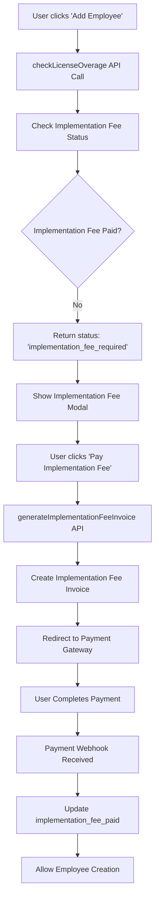

### Flow 3: Plan Upgrade Suggested

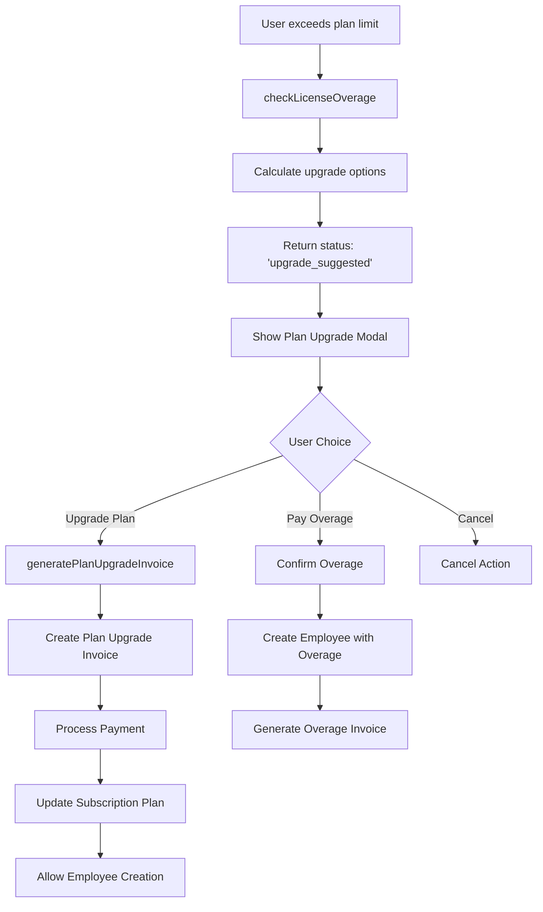

### Flow 4: License Overage Confirmation

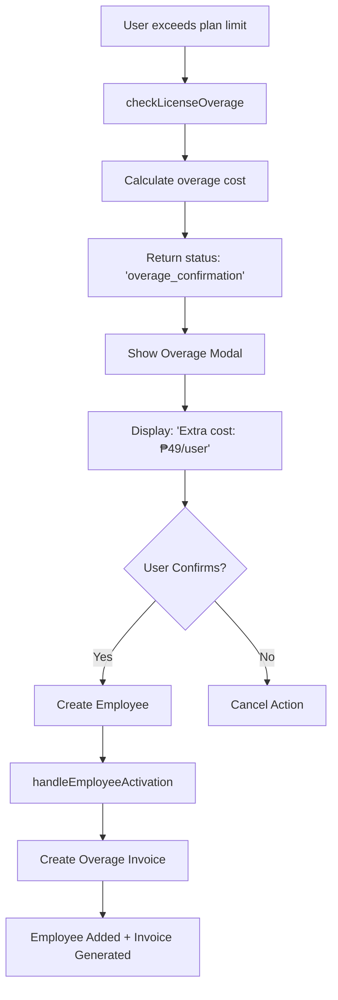

## Recurring Invoice Flows

### Flow 1: Monthly Subscription Renewal

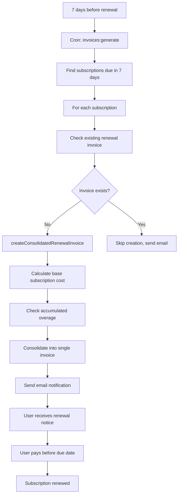

### Flow 2: Yearly Subscription with Monthly Overage

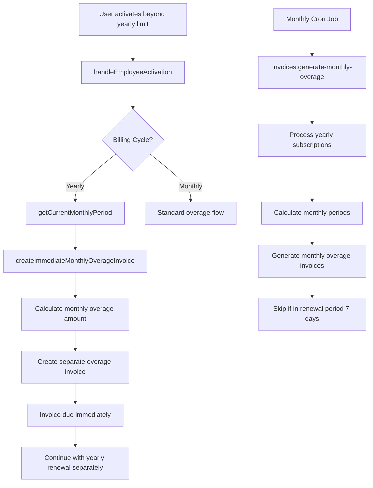

## Payment Processing Flows

### Flow 1: Standard Payment Flow

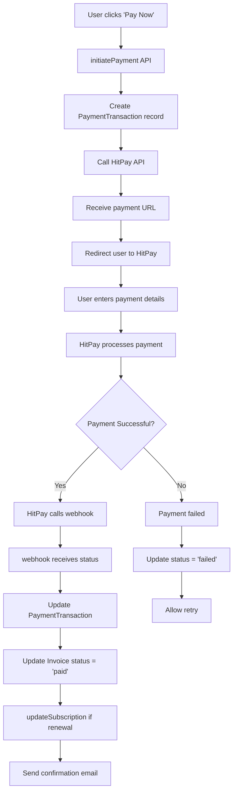

### Flow 2: Webhook Processing Flow

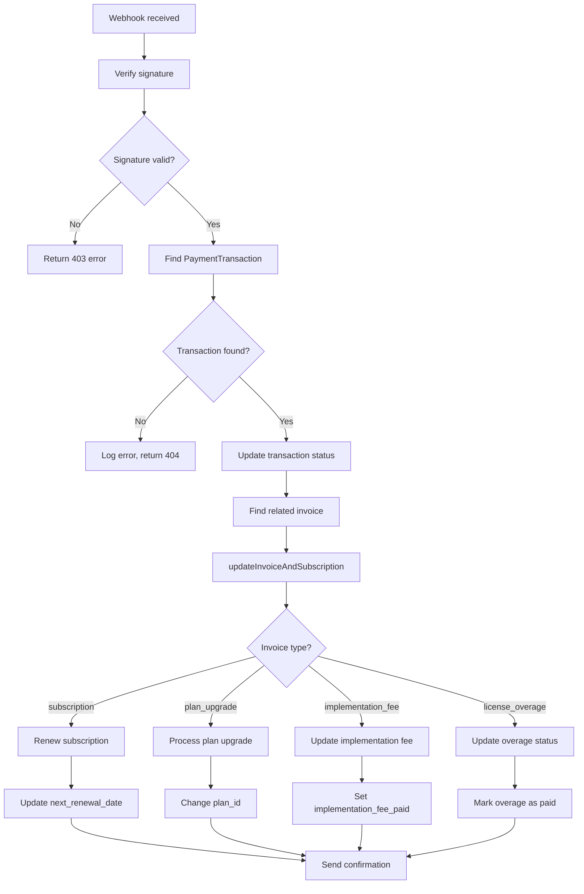

## Plan Upgrade Flows

### Flow 1: Mid-Cycle Plan Upgrade

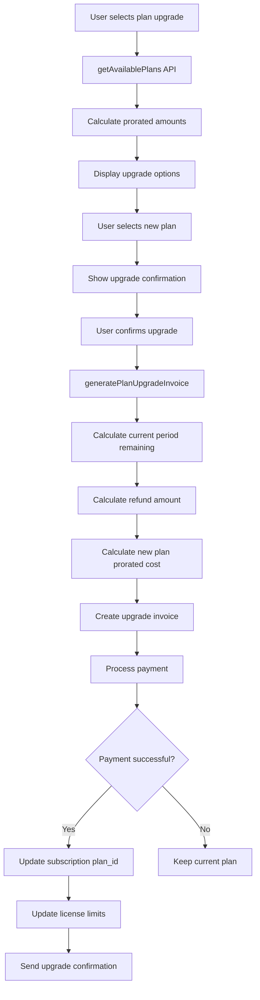

### Flow 2: Automatic Upgrade Suggestion

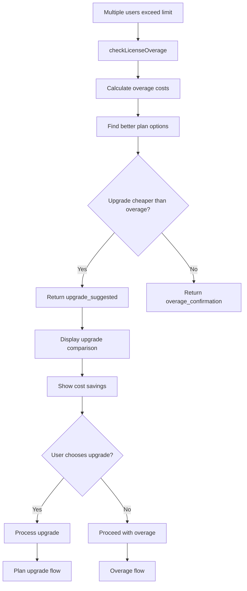

## Error Handling Flows

### Flow 1: Payment Failure Recovery

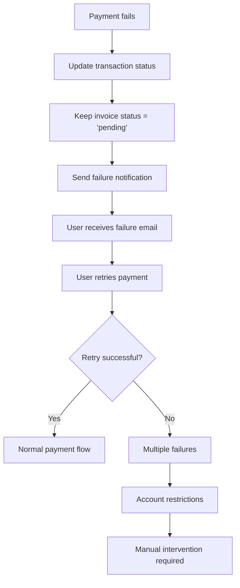

### Flow 2: Invoice Generation Failure

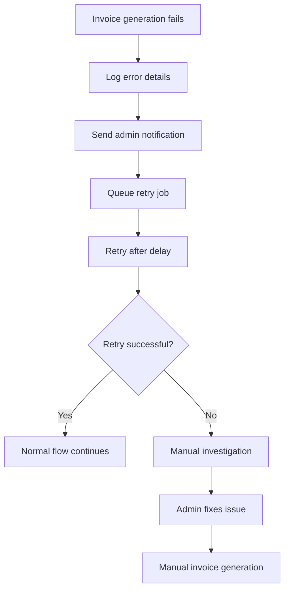

### Flow 3: License Count Mismatch

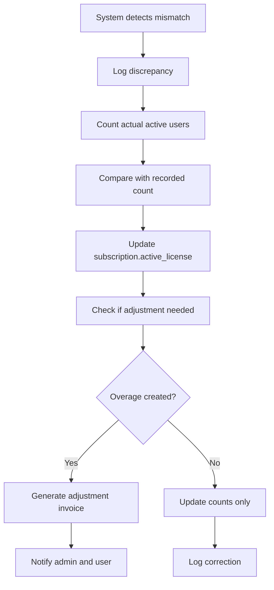

## Integration Points

### Frontend Integration Points

1. **Employee Management**
   - Pre-submission license checking
   - Modal dialogs for overage/upgrade
   - Payment initiation

2. **Billing Dashboard**
   - Usage display
   - Invoice listing
   - Payment buttons

3. **Subscription Management**
   - Plan comparison
   - Upgrade flows
   - Billing cycle switching

### Backend Integration Points

1. **Employee Controllers**
   - License checking middleware
   - Post-creation activation
   - Deactivation handling

2. **Billing Controllers**
   - Invoice generation
   - Payment processing
   - Subscription management

3. **Services Integration**
   - LicenseOverageService (core)
   - HitPayService (payments)
   - NotificationService (emails)

### Database Integration Points

1. **Transaction Management**
   - Multi-table updates
   - Rollback on failure
   - Consistency checks

2. **Audit Trail**
   - License usage logs
   - Payment transaction logs
   - Subscription change logs

3. **Performance Optimization**
   - Indexed queries
   - Chunked processing
   - Background jobs

## Monitoring & Alerting Flow

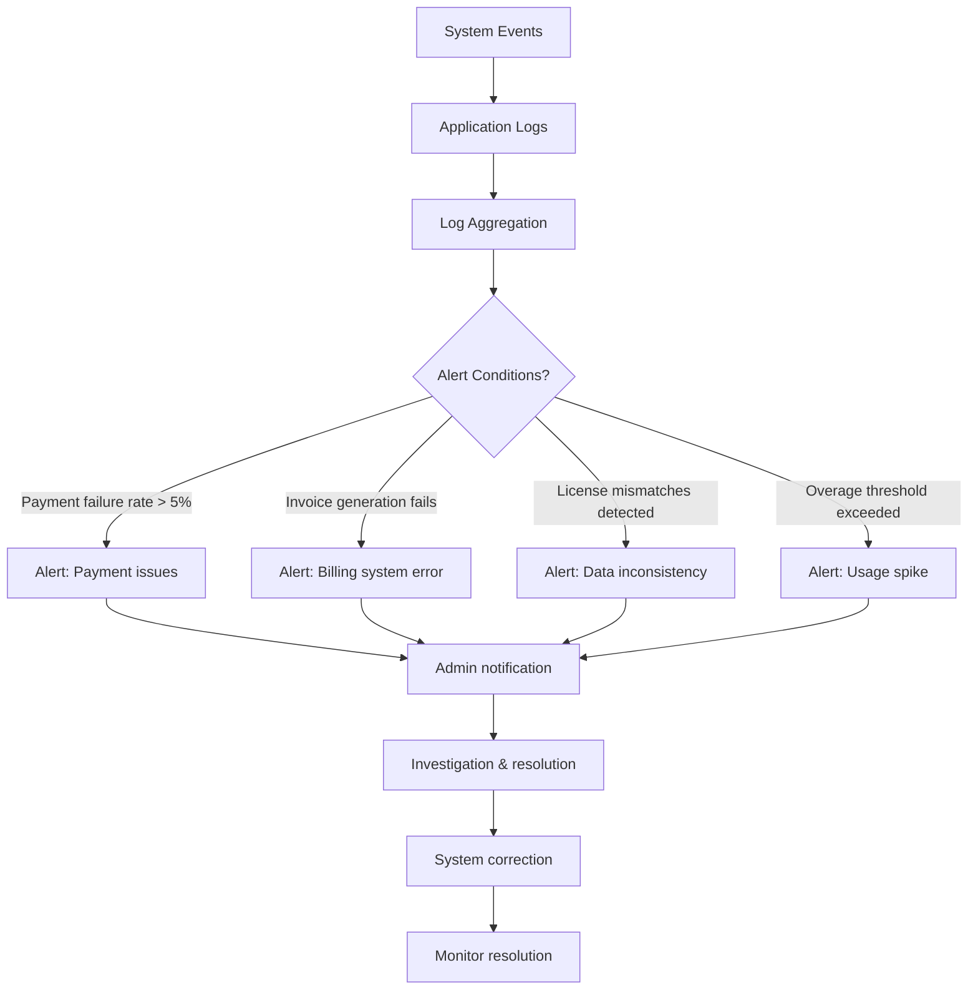

## Data Consistency Flows

### Flow 1: Daily Reconciliation

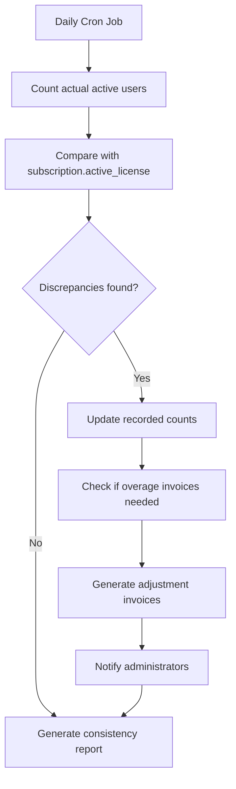

### Flow 2: Post-Payment Validation

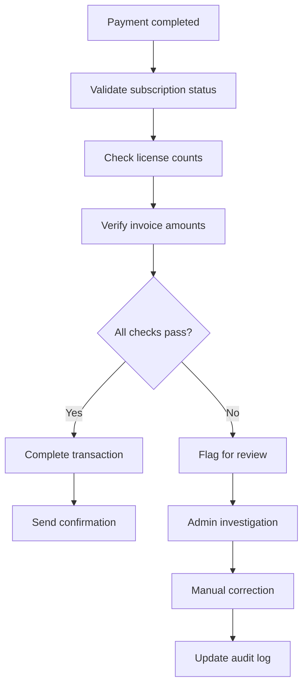

This comprehensive flow documentation covers all major billing scenarios and their interactions within the Vertex system. Each flow is designed to handle specific business requirements while maintaining data integrity and user experience.
